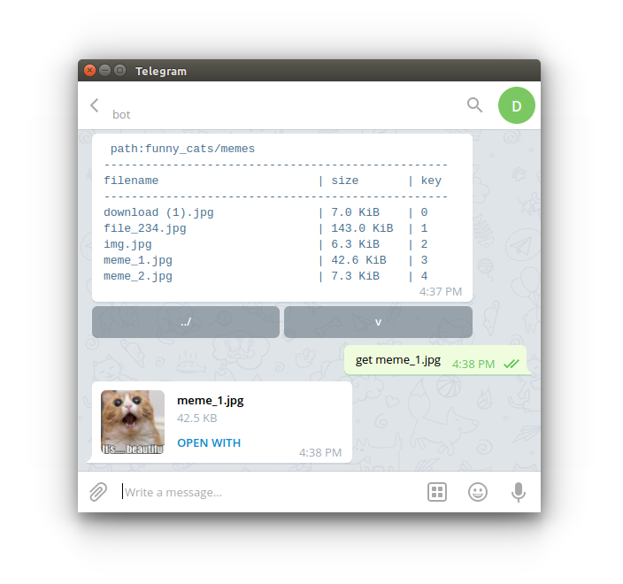
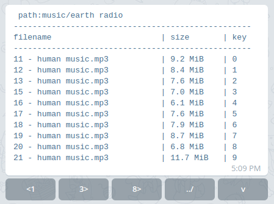

# Description

Telegram-bot, that provides access to local files. You can navigate through your folders and download files.



There is also pagination:



And compact mode (`v`):

```
 path:music/earth radio
-------------------------
|filename...............|
|size                key|
-------------------------
|11 - human music.mp3...|
|9.2 MiB               0|
-------------------------
|12 - human music.mp3...|
|8.4 MiB               1|
-------------------------
|13 - human music.mp3...|
|7.6 MiB               2|
-------------------------
|15 - human music.mp3...|
|7.0 MiB               3|
```


## Commands

A list of commands is available by typing `h`:

```
help - /h
first page - /f
last page - /l
next page - /n
go back to previous dir - /b
get file - /g filename
go to dir - dir name / dir number
change list view - /v
```

You can **access files** and folders not only by name, but also by key.

`get 13 - human music.mp3` = `get 2`

To **open a folder**, just type the key `[0-9]`.


# Configuration

It's pretty straightforward. All settings are stored in a json-file:

```
{
    "token" : "TOKEN",
    "user_configs":[
        {
            "user_id": 1,
            "shared_dirs": [
                {
                    "alias": "somename_1",
                    "path": "~/dir_1"
                },
                {
                    "alias": "somename_2",
                    "path": "~/dir_2/dir_3/"
                }
            ]
        }
    ]
}
```


- `user_id` - your unique user id;
- `shared_dirs` - list of shared folders;
- `token` - The ID you should get from [BotFather](https://core.telegram.org/bots#6-botfather);


# Dependencies

- `telepot`